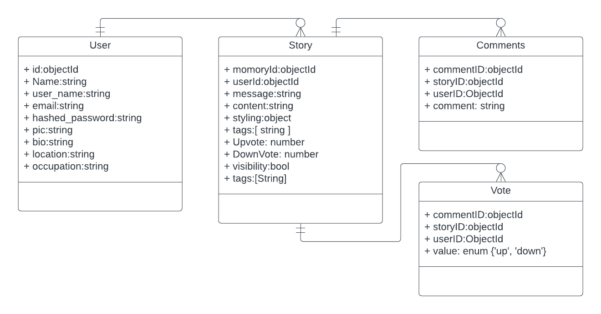
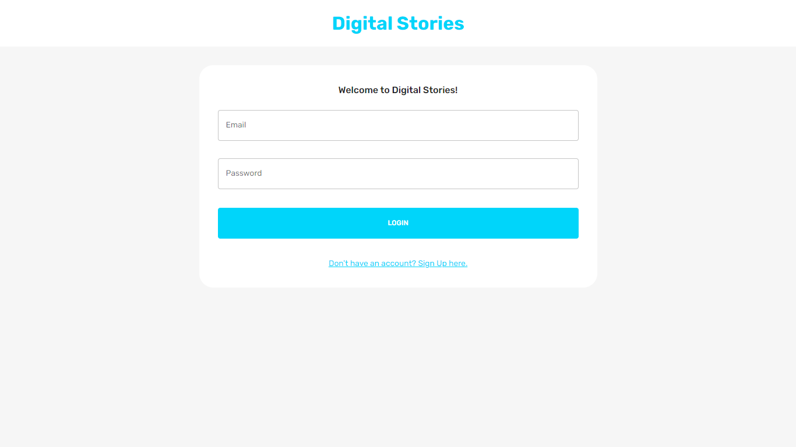
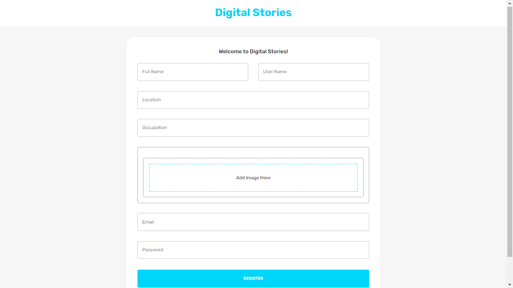
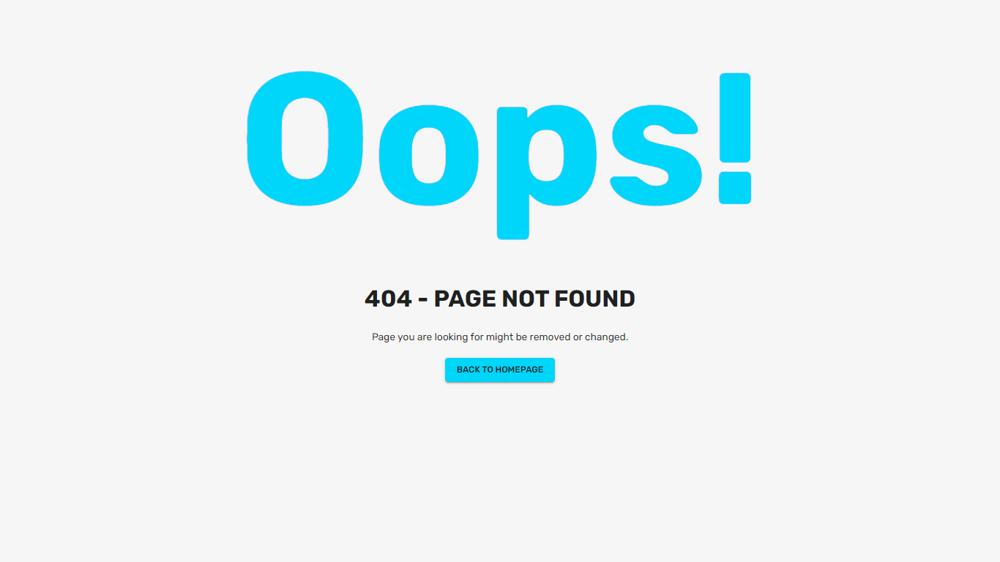
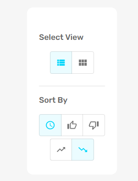
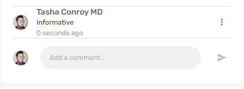

# Digital Stories
[](https://nodesource.com/products/nsolid)

[](https://travis-ci.org/joemccann/dillinger)


- `softwre hardware requirement`
- `Non functional Reuirement`
- `Future `

The project "Digital Story" is a web application that allows users to create and share stories in various formats, including text, image, and video. The application has a front end built using React with Redux, and a back end consisting of a RESTful API and a database.

## Features
-  `Registration`: Registration requires the user to enter their name, a unique username, a correctly formatted email address, and an optional profile picture.
-  `Login`: User Has to log in to create and view stories. If the user attempts to navigate to another page by entering the address in the address bar, they will be asked to log in before being directed to the requested page.
-   `Authoring Story`: Create a new story for authoring. Author a story with text, image, and video components.
- `Persistent Stories`:  Stories will be persistent for later access to preview, edit, and delete. 
- `Story View`: Stories will be displayed in either a list format, one below the other, or a grid format, based on the user's choice
- `Story Formatting`: Users will be able to style their stories with colors and fonts, as well as position and order them.
- `Private Stries`: All stories will be private by default, but users can choose to make them public. If a story is made public, it will be visible to all users
- `Story Vote`: Users can upvote/downvote stories, view the number of upvotes/downvotes a story has received, and what percentage of total users have reacted to a particular story.
- `Story Comment`:Users can comment on stories, and the trending stories feature is available at the /trending route.
- `Engagement`: In “engagement,” a user can see which stories they have reacted to and which of their stories other users have reacted to.
- `Trending`: Trending stories feature should be available at the /trending route. Trending stories include the most upvoted stories from all users.
- `Leaderboard`: The leaderboard is available at the /leaderboard route and shows each user's name, picture, total number of stories posted, and total upvotes received from all stories combined.
- `Sortable Stories`: Stories are sortable by creation timestamp, upvotes, and downvotes for each user and all users.
- `Dark/Bright Mode`: User can switch between dark and bright mode using a button in navbar.


## Getting Started

### Installation
To install the app, follow these steps:
1. Clone the repository:
```bash
    git clone https://github.com/syedwastil/MemoriesApp
```
2. Install the dependencies:
Digital Stories requires [Node.js](https://nodejs.org/) v10+ to run.
    1. Open terminal for `server` and run:
        ```bash
            cd memoriesApp/server
            npm install
        ```
    2. One another terminal for `client` and run:
        ```bash
            cd memoriesApp/client
            npm install
        ```

### Running the App
We will run server app and client app seperately.
1. For `Server` app:
    ```bash
        npm start
    ```
2. For `Client` app:
    ```bash
        npm run dev
    ```

This will start the server and the client, and open the app in your default browser.

## Architecture
### Overview
The app is built using the MERN stack:
- MongoDB for the database
- Express.js for the server
- React for the client
- Redux for client side store management
- Node.js as the runtime environment


### ERD
Entity relationship diagram of project is given as:


 the ERD may include the following entities:

- `User`: This entity will store information about the user, including their name, email, username, and password. Each user can have multiple stories.
- `Story`: This entity will store information about each story, including the author, the story content (text, image, video), and the style information (colors, fonts, etc.). Each story belongs to a single user and can have multiple comments and reactions (upvotes/downvotes).
- `Comment`: This entity will store information about each comment, including the author, the comment content, and the timestamp. Each comment belongs to a single story.
- `Vote`: This entity will store information about each vote, including the author, the vote value(upvote/downvote), and the timestamp. Each vote belongs to a single story and user.
The ERD will show the relationships between these entities, such as:

The ERD will show the relationships between these entities, such as:
- One-to-many relationship between `User and Story`: Each user can have multiple stories, but each story belongs to a single user.
- One-to-many relationship between `Story and Comment`: Each story can have multiple comments, but each comment belongs to a single story.
- One-to-many relationship between `Story and Vote`: Each story can have multiple votes, but each vote belongs to a single comment.

### Backend

The backend of the app is built using Express.js and Node.js. Here are the main components:
- `index.js`: The main server file that sets up the Express.js app and connects to the database. All third party middlewares are also defined here.
- `routes/auth.js,user.js,story.js,comment.js,vote.js`: Defines the API endpoints for CRUD operations on each entity separately.
- `controllers/auth.js,user.js,story.js,comment.js,vote.js`: Implements the logic for CRUD, aggregate and auth operations on each entity separately.
- `models/user.js,story.js,comment.js,vote.js`: Defines the schema for the entities in the database.

### Frontend
The frontend of the app is built using React with redux. Frontend code is mainly divided into state, scenes, components and widgets.
#### 1. State:
- `state/index.js` contain code of redux state in a single file. Redux toolkit is used to optimze writing the code.
#### 2. Scenes:
- `scenes/loginPage.jsx` contain forms for login and registration page both.
Login Page

Register Page


- `scenes/homePage.jsx` After login user will be redirected to home page which display info about user logged in, navbar, stories posted, sort and grid filter pannels.
Home Page [Light Mode]
- 

Home Page [Dark Mode]
- 

- `scenes/trendingPage.jsx` Display all stories sorted by upVotes.
Trending Page [Light Mode]
- 
Trending Page [Dark Mode]
- 
- `scenes/Leaderboard.jsx` Display top users with highest upVotes and their stats.
Leaderboard Page [Light Mode]
- 
Leaderboard Page [Dark Mode]
- 
- `scenes/profilePage.jsx` contain all stories posted by user whose profile is being visited.
- 
- `scenes/pageNotFound.jsx` Display 404 page.
- 

#### 2. Widgets:
- `components/postWidget.jsx` Render component for displaying a story.
 
- `components/createPostWidget.jsx` Render component for creating a story.
 
- `components/editPostWidget.jsx` Render component for edit a posted story.
 
- `components/sortWidget.jsx` Render component containing sort buttons.
 
- `components/commentWidget.jsx` Render component which display comments.
 

## Liscence

Markdown is a lightweight markup language based on the formatting conventions
that people naturally use in email.
As [John Gruber] writes on the [Markdown site][df1]

> The overriding design goal for Markdown's
> formatting syntax is to make it as readable
> as possible. The idea is that a
> Markdown-formatted document should be
> publishable as-is, as plain text, without
> looking like it's been marked up with tags
> or formatting instructions.

This text you see here is *actually- written in Markdown! To get a feel
for Markdown's syntax, type some text into the left window and
watch the results in the right.

## Tech

Digital Stories uses a number of open source projects to work properly:

- [AngularJS] - HTML enhanced for web apps!
- [Ace Editor] - awesome web-based text editor
- [markdown-it] - Markdown parser done right. Fast and easy to extend.
- [Twitter Bootstrap] - great UI boilerplate for modern web apps
- [node.js] - evented I/O for the backend
- [Express] - fast node.js network app framework [@tjholowaychuk]
- [Gulp] - the streaming build system
- [Breakdance](https://breakdance.github.io/breakdance/) - HTML
to Markdown converter
- [jQuery] - duh


## Plugins

Dillinger is currently extended with the following plugins.
Instructions on how to use them in your own application are linked below.

| Plugin | README |
| ------ | ------ |
| Dropbox | [plugins/dropbox/README.md][PlDb] |
| GitHub | [plugins/github/README.md][PlGh] |
| Google Drive | [plugins/googledrive/README.md][PlGd] |
| OneDrive | [plugins/onedrive/README.md][PlOd] |
| Medium | [plugins/medium/README.md][PlMe] |
| Google Analytics | [plugins/googleanalytics/README.md][PlGa] |


#### Building for source

For production release:

```sh
gulp build --prod
```

Generating pre-built zip archives for distribution:

```sh
gulp build dist --prod
```

out when the markdown processor does its job. There is no need to format nicely because it shouldn't be seen. Thanks SO - http://stackoverflow.com/questions/4823468/store-comments-in-markdown-syntax)

   [dill]: <https://github.com/joemccann/dillinger>
   [git-repo-url]: <https://github.com/joemccann/dillinger.git>
   [john gruber]: <http://daringfireball.net>
   [df1]: <http://daringfireball.net/projects/markdown/>
   [markdown-it]: <https://github.com/markdown-it/markdown-it>
   [Ace Editor]: <http://ace.ajax.org>
   [node.js]: <http://nodejs.org>
   [Twitter Bootstrap]: <http://twitter.github.com/bootstrap/>
   [jQuery]: <http://jquery.com>
   [@tjholowaychuk]: <http://twitter.com/tjholowaychuk>
   [express]: <http://expressjs.com>
   [AngularJS]: <http://angularjs.org>
   [Gulp]: <http://gulpjs.com>

   [PlDb]: <https://github.com/joemccann/dillinger/tree/master/plugins/dropbox/README.md>
   [PlGh]: <https://github.com/joemccann/dillinger/tree/master/plugins/github/README.md>
   [PlGd]: <https://github.com/joemccann/dillinger/tree/master/plugins/googledrive/README.md>
   [PlOd]: <https://github.com/joemccann/dillinger/tree/master/plugins/onedrive/README.md>
   [PlMe]: <https://github.com/joemccann/dillinger/tree/master/plugins/medium/README.md>
   [PlGa]: <https://github.com/RahulHP/dillinger/blob/master/plugins/googleanalytics/README.md>
